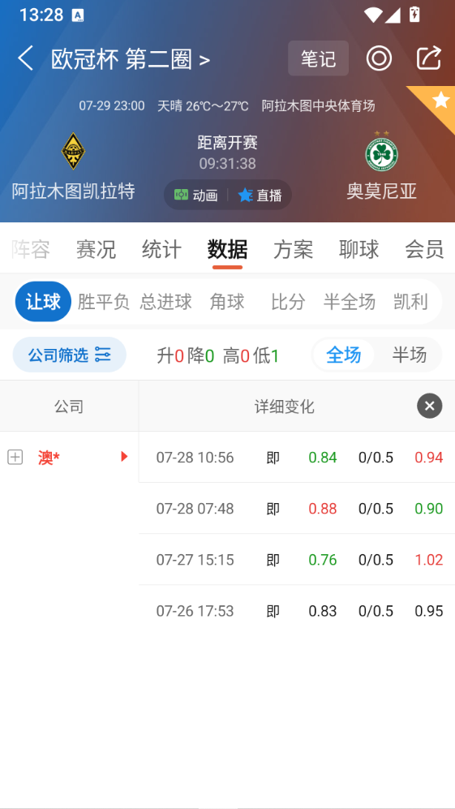
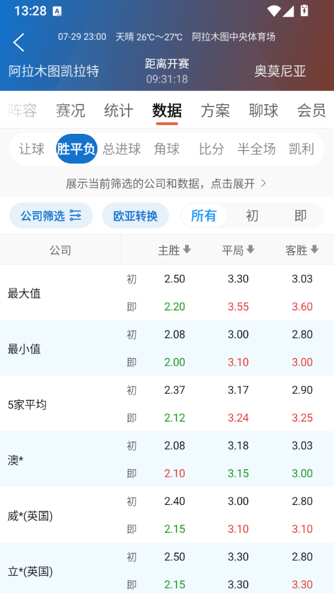
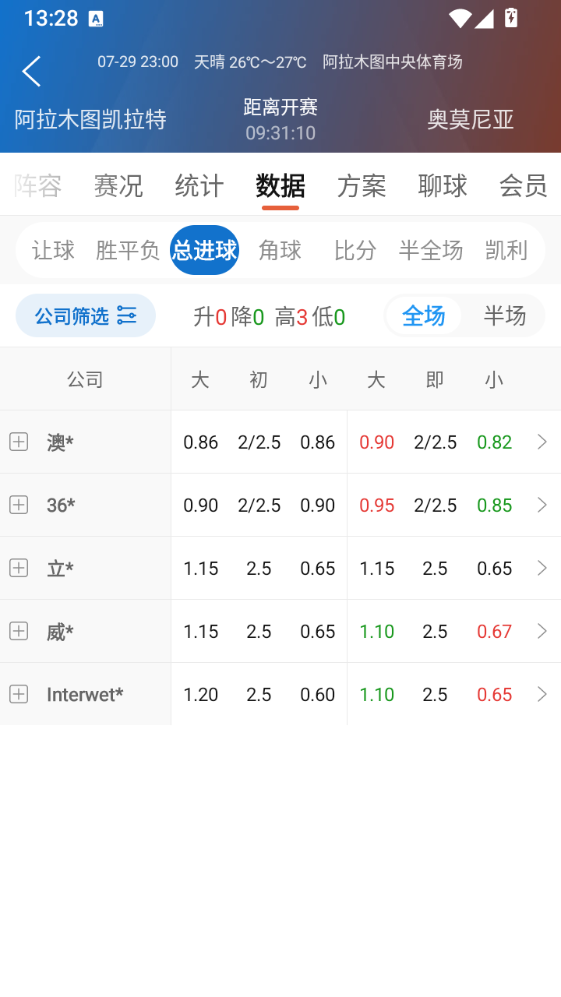
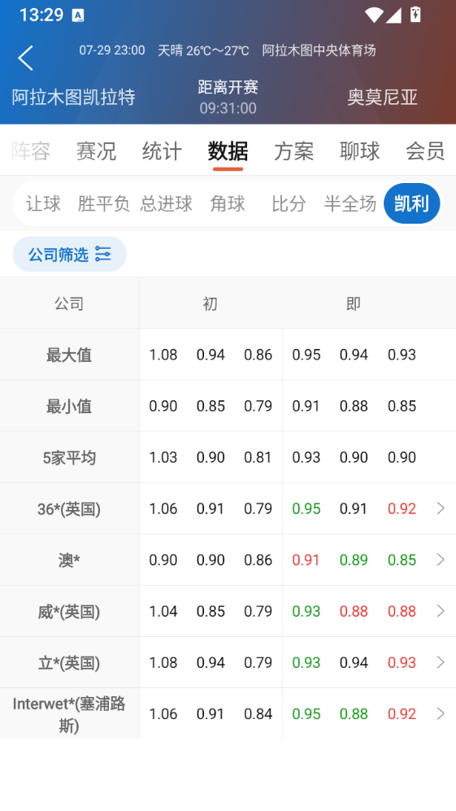

# 阿拉木图凯拉特 vs 奥莫尼亚

<!-- section:prematch-facts -->
## 一、赛前事实

### 基本面与数据来源

- 比赛：阿拉木图凯拉特（主）vs 奥莫尼亚（客）。
- 赛事：欧冠资格赛第二轮。
- 开赛时间：2026-07-29 23:00（Asia/Shanghai）。
- 截图时间：约 2026-07-29 13:28～13:29，距开赛约 9 小时 31 分。
- 场地：截图显示为阿拉木图中央体育场。
- 天气：截图显示晴，26℃～27℃。
- 当前截图没有提供近期战绩、伤停、预计首发、赛程密度及本轮是否存在首回合比分背景，这些信息仍待补充。

### 原始截图

### 盘口时间序列

| 采集时间 | 距开赛 | 机构 | 让球盘 | 上盘水位 | 下盘水位 | 欧赔胜 | 欧赔平 | 欧赔负 | 大小球 |
|---|---:|---|---|---:|---:|---:|---:|---:|---|
| 07-26 17:53 | 未记录 | 澳* | 主让0/0.5 | 0.83 | 0.95 | - | - | - | - |
| 07-27 15:15 | 未记录 | 澳* | 主让0/0.5 | 0.76 | 1.02 | - | - | - | - |
| 07-28 07:48 | 未记录 | 澳* | 主让0/0.5 | 0.88 | 0.90 | - | - | - | - |
| 07-28 10:56 | 未记录 | 澳* | 主让0/0.5 | 0.84 | 0.94 | - | - | - | - |

### 胜平负快照

| 公司/统计 | 主胜初 | 平局初 | 客胜初 | 主胜即 | 平局即 | 客胜即 |
|---|---:|---:|---:|---:|---:|---:|
| 最大值 | 2.50 | 3.30 | 3.03 | 2.20 | 3.55 | 3.60 |
| 最小值 | 2.08 | 3.00 | 2.80 | 2.00 | 3.10 | 3.00 |
| 5家平均 | 2.37 | 3.17 | 2.90 | 2.12 | 3.24 | 3.25 |
| 澳* | 2.08 | 3.18 | 3.03 | 2.10 | 3.15 | 3.00 |
| 威*(英国) | 2.40 | 3.00 | 2.80 | 2.15 | 3.10 | 3.10 |
| 立*(英国) | 2.50 | 3.30 | 2.80 | 2.15 | 3.30 | 3.30 |

### 总进球快照

| 公司 | 大球初 | 初盘 | 小球初 | 大球即 | 即时盘 | 小球即 |
|---|---:|---:|---:|---:|---:|---:|
| 澳* | 0.86 | 2/2.5 | 0.86 | 0.90 | 2/2.5 | 0.82 |
| 36* | 0.90 | 2/2.5 | 0.90 | 0.95 | 2/2.5 | 0.85 |
| 立* | 1.15 | 2.5 | 0.65 | 1.15 | 2.5 | 0.65 |
| 威* | 1.15 | 2.5 | 0.65 | 1.10 | 2.5 | 0.67 |
| Interwet* | 1.20 | 2.5 | 0.60 | 1.10 | 2.5 | 0.65 |

### 凯利指数快照

| 公司/统计 | 主初 | 平初 | 客初 | 主即 | 平即 | 客即 |
|---|---:|---:|---:|---:|---:|---:|
| 最大值 | 1.08 | 0.94 | 0.86 | 0.95 | 0.94 | 0.93 |
| 最小值 | 0.90 | 0.85 | 0.79 | 0.91 | 0.88 | 0.85 |
| 5家平均 | 1.03 | 0.90 | 0.81 | 0.93 | 0.90 | 0.90 |
| 36*(英国) | 1.06 | 0.91 | 0.79 | 0.95 | 0.91 | 0.92 |
| 澳* | 0.90 | 0.90 | 0.86 | 0.91 | 0.89 | 0.85 |
| 威*(英国) | 1.04 | 0.85 | 0.79 | 0.93 | 0.88 | 0.88 |
| 立*(英国) | 1.08 | 0.94 | 0.79 | 0.93 | 0.94 | 0.93 |
| Interwet*(塞浦路斯) | 1.06 | 0.91 | 0.84 | 0.95 | 0.88 | 0.92 |

<!-- section:prematch-reasoning -->
## 二、赛前推演

<!-- analysis-content:start -->
<!-- TODO:replace-before-lock -->

在完成规则、场景和案例检索后填写缺失信息、理论盘口、双向假设、证据、反证和规则引用。
<!-- analysis-content:end -->

<!-- section:prematch-locked -->
## 三、赛前最终结论

<!-- TODO:replace-before-lock -->

- 主线方向：
- 次选方向：
- 放弃分析条件：
- 总进球区间：
- 比分区间：
- 置信度依据：
- 最大风险：
- 保留的反例：

<!-- section:live-update -->
## 四、临场更新

临场变化按 `### YYYY-MM-DD HH:mm` 追加，不覆盖赛前章节。

<!-- section:result -->
## 五、实际赛果

比赛结束后由 `odds-journal finish` 写入结构化赛果。

<!-- section:postmatch-review -->
## 六、赛后复盘

<!-- review-content:start -->
<!-- TODO:replace-before-review -->

在此记录正确判断、错误判断、遗漏信号、错误分类、规则反例和可复用教训。
<!-- review-content:end -->
